<!-- ───────────────────────── HERO ───────────────────────── -->

# 💫 About Me:
🔭 I spend most of my time building things — AI agents, geospatial analysis, healthcare prototypes, robotics. Mostly learning by doing.  
👯 Happy to collaborate on robotics builds, ML tools, or anything where software meets the real world.  
🌱 Currently learning how to take prototypes from "works on my machine" to something people can actually rely on.  
⚡ Fun fact: I like building things that move, sense, think, or occasionally refuse to work for no obvious reason.

## 🌐 Socials:

<!-- ───────────────────────── PROJECTS ───────────────────────── -->

# 🔨 Some things I've built:

 

<!-- ───────────────────────── STATS ───────────────────────── -->

# 📊 GitHub Stats:

<!-- contribution snake — generated by .github/workflows/snake.yml -->
<picture>
  <source media="(prefers-color-scheme: dark)" srcset="https://raw.githubusercontent.com/Hussain800/Hussain800/output/github-snake-dark.svg"/>
  <source media="(prefers-color-scheme: light)" srcset="https://raw.githubusercontent.com/Hussain800/Hussain800/output/github-snake.svg"/>
  
</picture>

<!-- ───────────────────────── FOOTER ───────────────────────── -->

